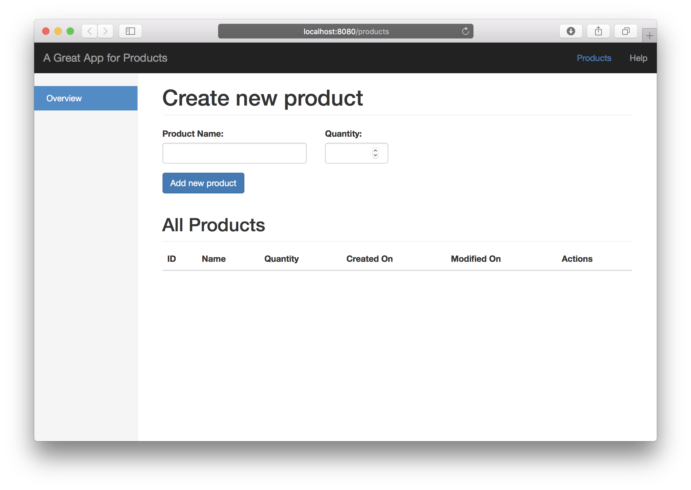
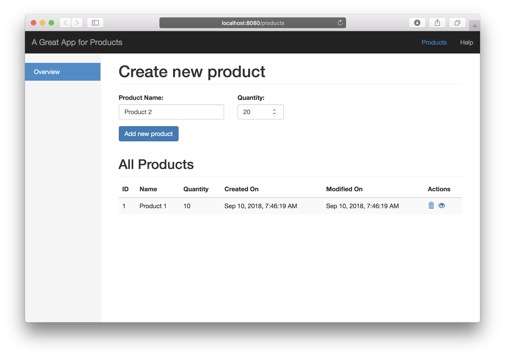
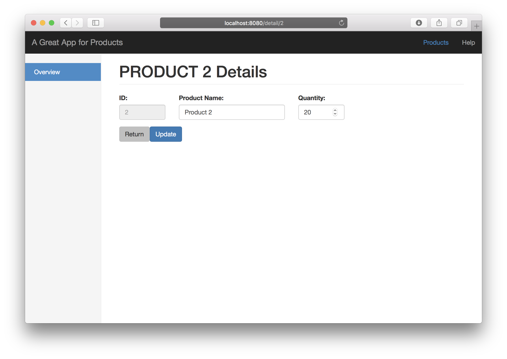
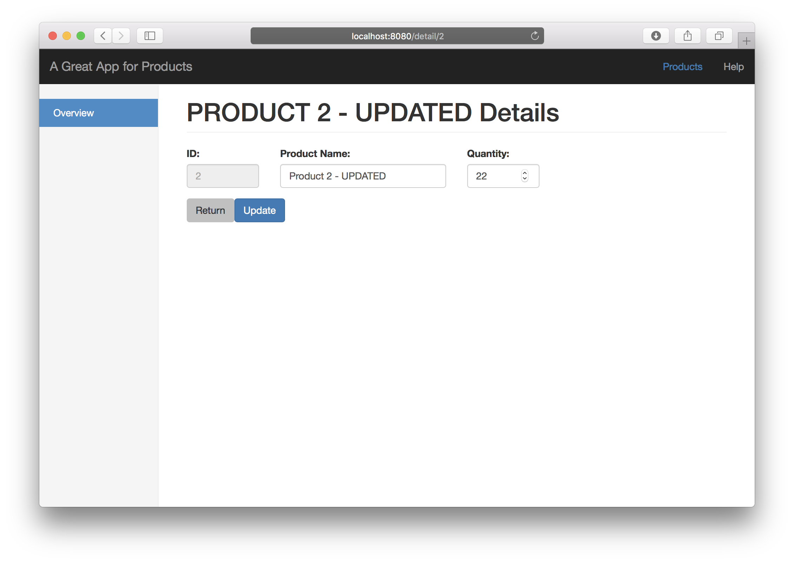
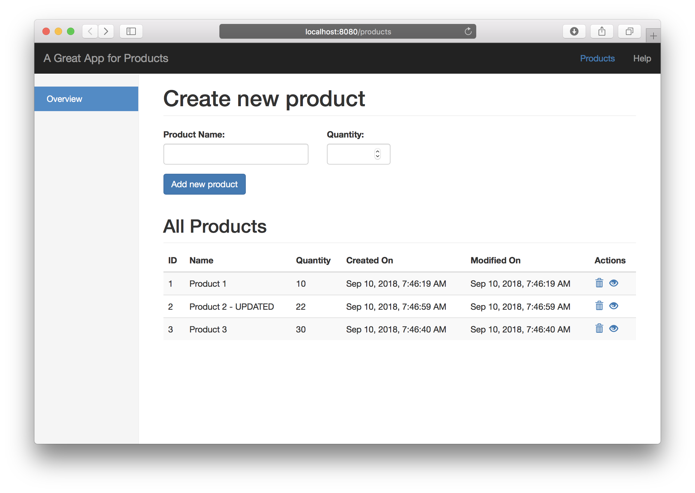
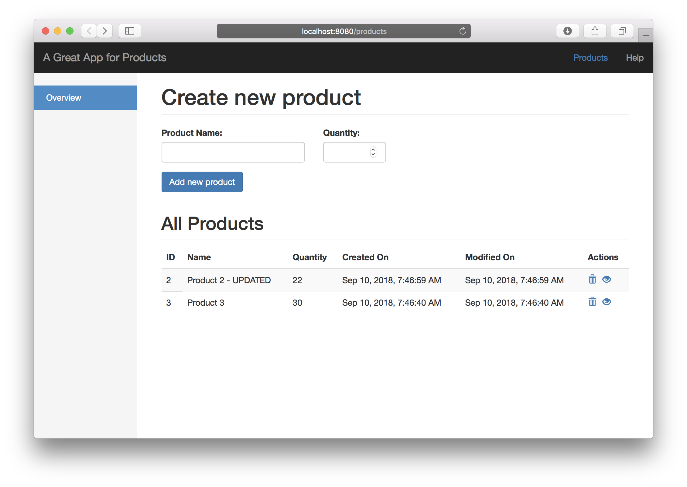

# ProductApp
This repository is the home of the development of a basic set of services to manage Products with the goal of practicing the use of different technologies like Spring Boot, Angular and others.

- [Quick Start](#quick-start)
- [Long Start](#long-start)
- [Architecture](#architecture)
- [Tutorial](#tutorial)
- [Enhancements](#enhancements)

## Quick Start
- Make sure you have MySQL up and running on port `3306` and:
    - Database is created: ``CREATE DATABASE `productdb` DEFAULT CHARACTER SET utf8 ;``
    - User `springuser` with password `springuser` exist.
    - You can following the steps below to create the database and configure the user.
    ```
        mysql> create database productdb;
        mysql> create user 'springuser'@'localhost' identified by 'springuser';
        mysql> grant all on productdb.* to 'springuser'@'localhost';
    ```
- `git clone https://github.com/diegoaugusto/ProductApp.git`
- `java -jar server/target/ProductApp-server-0.0.1-SNAPSHOT.jar`
- Access http://localhost:8080

## Long Start
In order to run this project locally, it is necessary to download some tools (if you don't have them already) and proceed with the steps below.

### Tools
These set of tools were used during the development of this project and are the recommended tools. 
Other versions or different tools that do the same job were not tested and therefore may or may not not work properly. Feel free to try it and provide your feedback.

**-** | **Selected Option**
------------ | ------------- 
OS | MacOs
Java :coffee: | Oracle 1.8.0_171
MySQL | MySQL 8.0.12
Build Automation | Apache Maven 3.5.2  
IDE | Eclipse Oxygen.3a Release (4.7.3a)

### Steps
- Follow the same configuration for the database as mentioned in the [Quick start section](#quick-start).
- `git clone https://github.com/diegoaugusto/ProductApp.git`
- `cd ProductApp`
- `./mvnw clean install`
- `java -jar server/target/ProductApp-server-0.0.1-SNAPSHOT.jar`
- Access http://localhost:8080

In these steps, you will download the project, build it and run it.

## Architecture
The application is composed by two modules:

- Client: Angular 6 project composed by components used to show the product list, create new products, show the details of a product and it contains operations to delete and edit existing products.
- Server: Spring Boot application created to provide the REST services used by the client module.


Access the [Products API](ProductsApi.md) to see examples of how it works. This Products API documentation has been automatically generated with the Swagger Editor. In order to see a more appealing and usable documentation about the API, load the [products-service-swagger.yaml](./server/api/products-service-swagger.yaml) file in [https://editor.swagger.io](https://editor.swagger.io). 

## Tutorial
After accessing http://localhost:8080, you will see the following screen:


Then, you can start adding products to the list. For that, you will need to provide the product name and quantity.


You can also edit existing products by clicking the eye icon in the product list.


While you edit the product name, you will see it changing the header of this page too.


After saving the edited product, you will be redirected to the page showing the list of products.


If you press the trash icon, the product will be deleted.


## Enhancements
There is a list of enhancements (TODOs) planned for this project:

- Decrease size of the package (remove files that are not needed to be on Git)
- Improve unit test coverage